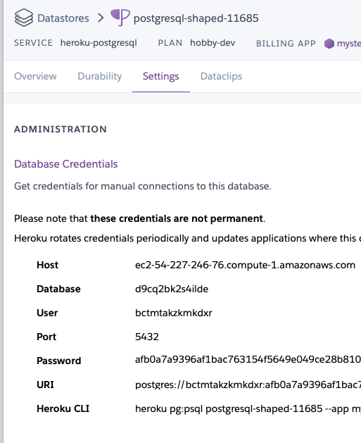
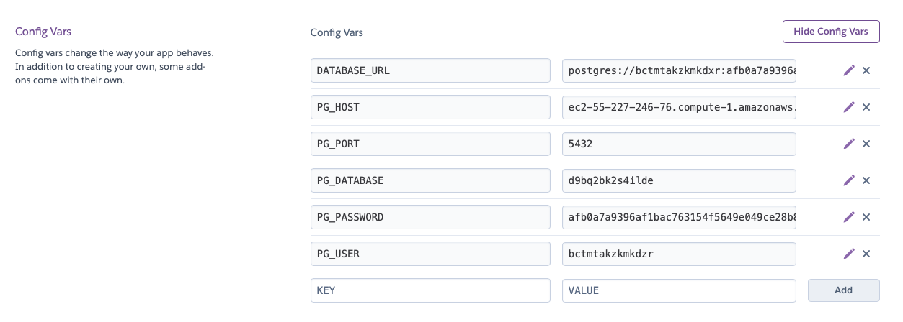
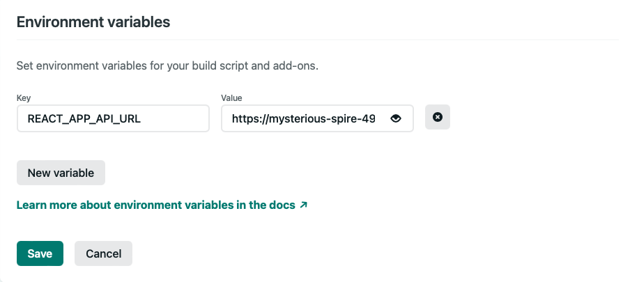

# Getting Started With The CTA - 8.1 Guide

- select `use this template` in [this repo](https://github.com/joinpursuit/pern-final-project-template) and follow the usual steps.
- clone down your version of the repo.

## Getting Started

**NOTE:** - You will have 3 `package.json` files in this project

- **Top level** - necessary for Heroku deployment: you don't need to do anything with this file, it is set up for you
- **back-end** - everything to do with the express/postgres backend
- **front-end** - everything to do with the create-react-app front-end

### Project Structure

```
├── README.md (what you are currently reading)
├── back-end (a basic express app)
├── front-end (a basic create-react-app)
└── package.json (necessary boilerplate for heroku deployment)
```

### `back-end` Set Up and Deployment to Heroku

#### Basic App

**/back-end**

- `cd back-end`
- `npm install`

make sure you are on the same level as the `package.json` of the `back-end` directory

- `touch .env`

```
PORT=3333
PG_HOST=localhost
PG_PORT=5432
PG_DATABASE=postgres
PG_USER=postgres
PG_PASSWORD=""
```

#### Database

Create a database with whatever name you want using the `psql` shell.

Add `\c [your new database name]` to the top of both the `back-end/db/schema.sql` and `back-end/db/seed.sql` files.

Back in the zsh shell, in the `back-end` directory, run:

- `npm run db:init`
- `npm run db:seed`

Query the database and routes locally. If it does not work locally, it will not work on Heroku.

Fix bugs.

#### Deploying The Back End

When ready:

- `cd` to the root directory.
- `heroku create`
- `git add .`
- `git commit -m 'heroku deployment`
- `git subtree push --prefix back-end heroku main` - if this does not work, go to Heroku dashboard => deployment and add the remote ie `heroku git:remote -a <your-heroku-app-name>`.

Open your Heroku app. You should see the `Hello, world!` message.

#### Adding the Database on Heroku

In the Heroku dashboard, go to `Overview` choose `configure add ons`

In the search bar `Quickly add add-ons` - search for `postgres` - choose `heroku postgres`

- Choose hobby dev.
- Note: even though hobby dev is free, you may be required to provide a credit card.
- In new view, click on `Heroku Postgres`.
- It should open a new window or tab. Click on Settings and then on View Credentials.



You will need to make these key value pairs in your Heroku app.

**IMPORTANT**
The `keys` must match perfectly with what is in your `db/dbConfig.js` file and your local `.env`. Not the values, but the key names.

- Open a new tab/window and go to the main page of your heroku app. Choose Settings.
- Click on Reveal Config Variables.
- Add the values from the previous step (the Heroku Postgres "Database Credentials" page) to new key/value pairs, **keeping the key names the same as the `db/dbConfig.js` keys**.

Your Heroku "Config Vars" page should have at least the below fields.
**Note:** these are false credentials and given for example only.

|    Keys     |                        Values                         |
| :---------: | :---------------------------------------------------: |
|   PG_HOST   |       ec2-55-227-246-76.compute-1.amazonaws.com       |
|   PG_PORT   |                         5432                          |
| PG_DATABASE |                    d9bq2bk2s4ilde                     |
|   PG_USER   |                    bcwmtakzkmkdxr                     |
| PG_PASSWORD | afb0a7a9396af1bac763154f5649e049ce280658bef0ded7efde6 |

Or, as a picture:



- Go back to the Heroku database view => settings page and copy the value for `Heroku CLI`. It should be something like `heroku pg:psql postgresql-shaped-11685 --app mysterious-spires-49488`.
- Switch to a terminal and make sure you are on the same directory level as the `package.json` of your `back-end` directory.
- Paste the Heroku CLI command into your terminal. It should open a Postgres shell.

Run the following:

- `\i ./db/prod_schema.sql`
  - success should say `CREATE TABLE`
- `\i ./db/prod_seed.sql`
  - success should say `INSERT 0 7`
- `\q`

This will insert the test table with the days of the week.

Later, when you have built out your app to have your own schema and seed data, you will:

- Edit the `db/schema.sql` file to be your own.
- Edit the `db/seed.sql` file to be your own.
- Reopen your _local_ `psql` shell and run those files.

And, when you're ready to change the deployed version of the database to match:

Do the above three steps, but with the `prod_` versions of the files, and with _Heroku's_ `psql` shell, run from the `heroku pg:psql` command you used above.

### `front-end` Set Up

**/front-end**

- `cd front-end`
- `npm instal`
- `touch .env`

Replace the URL given with your new Heroku URL.

**.env**

```
REACT_APP_API_URL=https://mysterious-spire-49483.herokuapp.com
```

- `npm start`

Make sure your back-end is still running. You should see an unordered list of the days of the week, coming from your back-end. If it does not work locally, it will not work when it is deployed. Keep debugging until it works

Go to Netlify, choose `New site from Git`

- choose continuos deployment, GitHub.
- configure the Netlify app on GitHub

Follow the prompts to add your project repo to Netlify
Once, authorized, configure to launch app from

- Base directory: `front-end`
- Build command: `npm run build`
- Publish directory: `build` (may appear as `front-end/build`)
- add the environmental variable




Note: if you were starting your own create-react-app from scratch, in order to use react-router, you would need to add the file `_redirects` to `/public`. You do NOT have to do that here.

The content of the `_redirects` file should be

```
/* /index.html 200
```

[More info on deploying with Router.](https://www.netlify.com/blog/2016/07/22/deploy-react-apps-in-less-than-30-seconds/#main)
